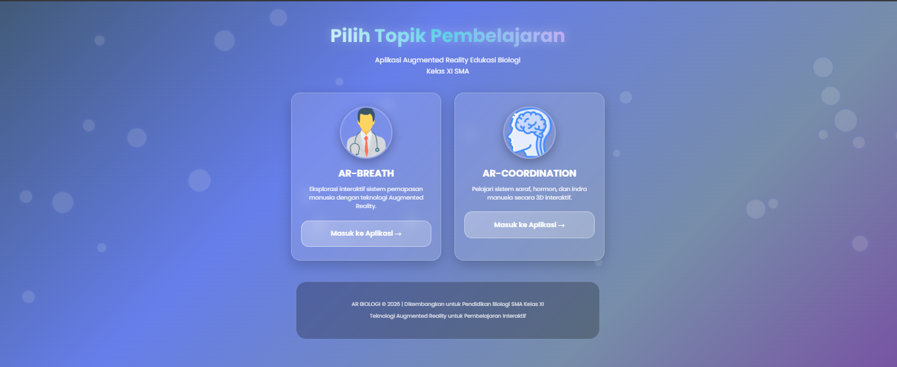

# AR Biologi SMA - Augmented Reality Edukasi Biologi Kelas XI 🧠✨

**Aplikasi Web Augmented Reality** untuk pembelajaran interaktif Biologi SMA Kelas XI, fokus pada **Sistem Organ Manusia** (Sistem Pernapasan & Sistem Koordinasi).

Proyek ini adalah landing page edukasi dengan desain modern dan animasi menarik yang mengarahkan pengguna ke dua modul AR berbasis web (menggunakan **AR.js** + **A-Frame**). Pengguna dapat mengakses pengalaman 3D interaktif langsung di browser tanpa instalasi aplikasi tambahan (hanya butuh kamera dan marker).

 <!-- Upload screenshot landing page -->

### 🚀 Fitur Utama
- **Splash screen** dengan animasi gradient dan loading elegan
- **Background animasi particles** floating untuk efek futuristik
- **Responsive design** (mobile-first, tampil bagus di HP/tablet/desktop)
- **Menu grid** dengan card interaktif (hover effect, glassmorphism)
- Dua modul AR:
  - **AR-BREATH**: Eksplorasi 3D sistem pernapasan manusia (paru-paru, alveolus, dll.)
  - **AR-COORDINATION**: Visualisasi sistem saraf, hormon, dan indra
- Pure HTML/CSS/JS (vanilla) + AR.js di sub-modul → ringan dan cepat load
- Tidak butuh app eksternal → cukup scan marker dengan kamera HP/browser

### 🛠 Tech Stack
- HTML5
- CSS3 (Flexbox, Grid, Animations, Glassmorphism, Gradient)
- JavaScript Vanilla (particles, splash screen transition)
- AR.js + A-Frame (di folder `AR-Breath/` dan `AR-Coordination/`)
- Google Fonts (Poppins)
- Icon dari Flaticon

🏆 Konteks Proyek
Proyek ini dibuat sebagai media pembelajaran interaktif Biologi SMA, menggabungkan web development dengan teknologi Augmented Reality untuk meningkatkan engagement siswa.
